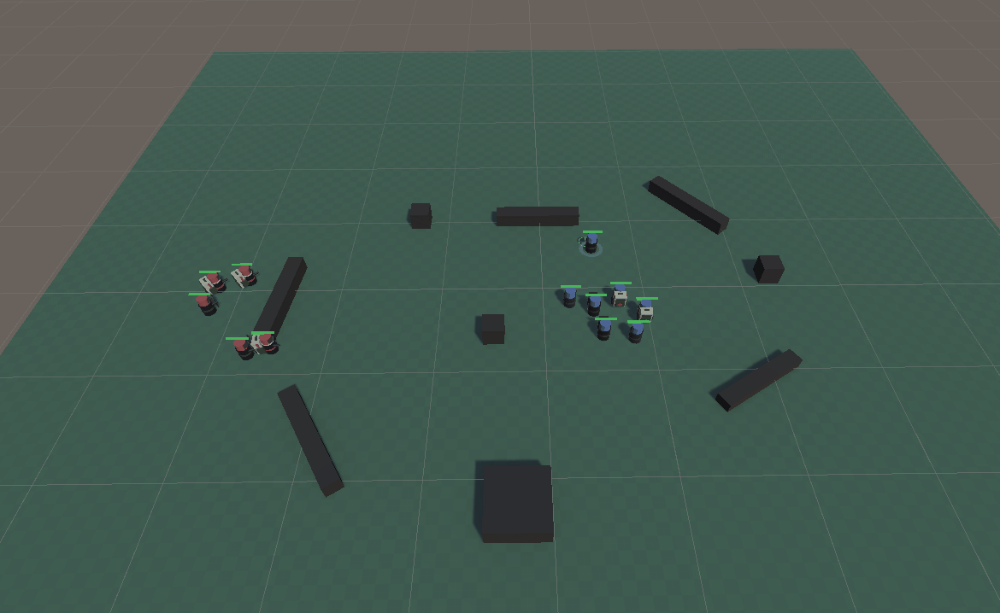
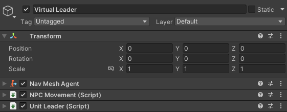
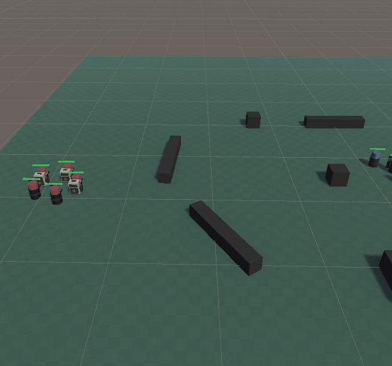
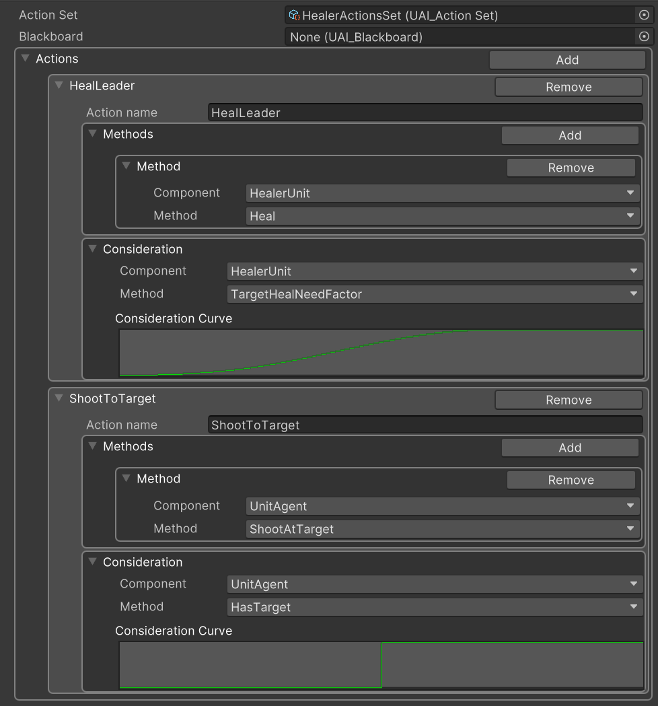
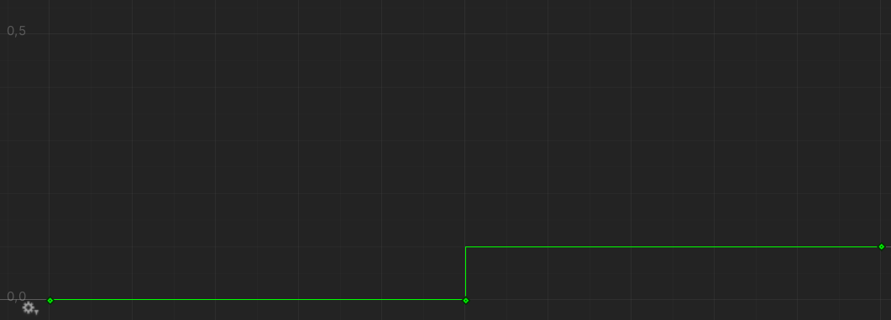
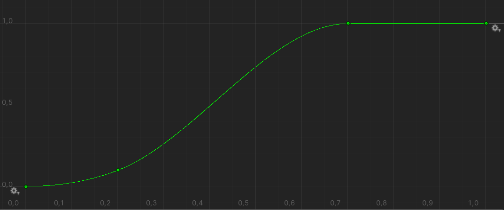
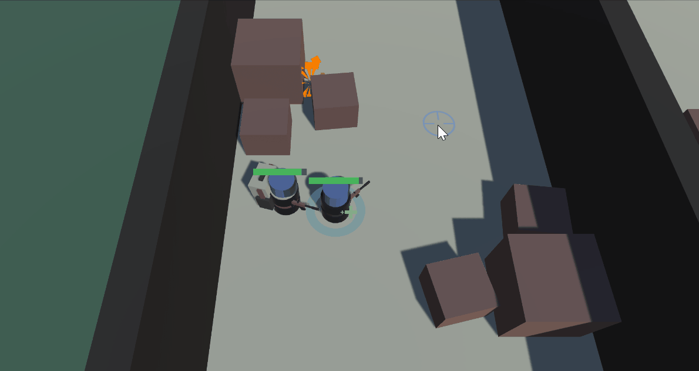
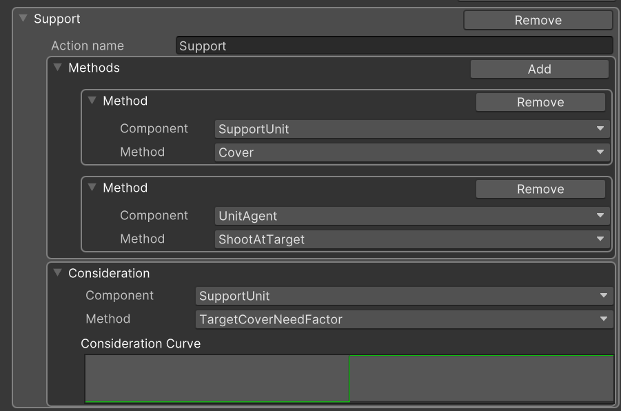
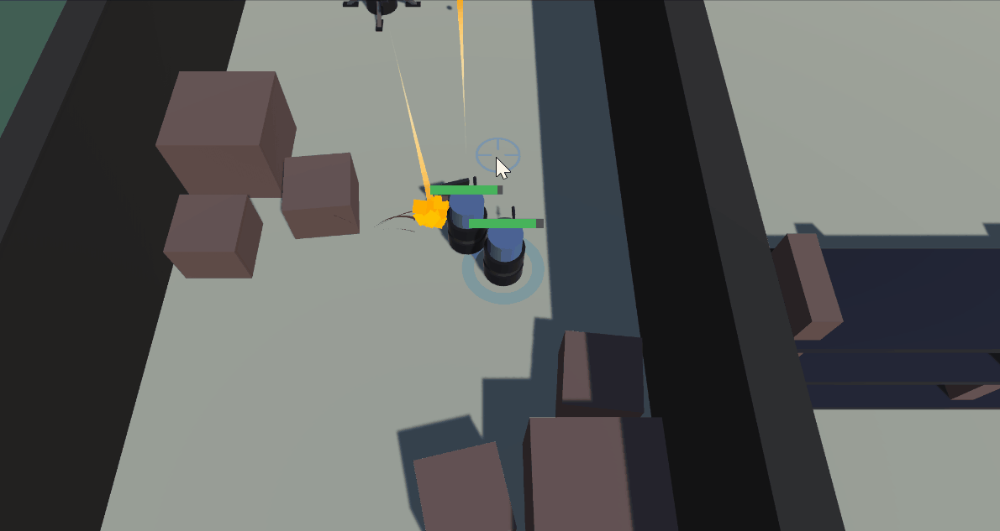

# Skadaï: *Decision-making and movements in AI* - **Unity/C#**
### ISART DIGITAL GP3, School Project: *Benjamin MARIN, Noé MOUCHEL, Rémi GINER*

<!-- ABOUT THE PROJECT -->
# About The Project 
**Built with Unity 2021.3.5f1**

The goal of the project is to make an NPC AI that moves as a squad and can interact with the player, in a real-time action game.

# Features & usage

## Features
- Smart AIs
- Utility system
- Ally and enemy squad system
- Character classes (Healer, Support...)

## Controls
The controls are made for keyboard only:
- WASD - Move
- Mouse movements - Aim and move squad
- Left click - Shoot
- Right click - Call for support fire

# How to launch
Launch the exe directly from the archive.

# Details

## Utility system

## Squad system

### **Unit system**

To make a Squad system compatible with different types of controllers ( direct player inputs and NavMesh calculations), we had to create a leader-squad system. When the leader decides to make a move, the rest of the squad must follow this order. The units will not try to reachg the leader directly, but the position where the leader wants to be. This allows us to easily do a patrol system and a unit tracking.

To make the leader send its orders each time it wants to move, we used inheritance and UnityEvents. The leader's orders are linked to its movements updates.

```cs
leader.GetComponent<Movement>().OnMoveChange.AddListener(UpdatePositions);
```

<div style="text-align:center">


*Movements of a Player directed squad and an AI directed squad*
</div>

To create an AI team, we had to create a virtual leader (with no collision nor rendering) who cannot die.

<div style="text-align:center">



*Prefab of a Virtual Leader*
</div>

### **Formation system**
To make the units follow the leader's order, the leader must tell the squad (which is a separate GameObject) where it wants to go. Before the squad tells its units where to go, it calculates the correct position that follows its formation rule (which is a manually configured ScriptableObject) for each unit.

<div style="text-align:center">


*Modular circular formation of a squad*
</div>

### **Squad controller**
To achieve a proper Squad system, we had to create an entity that represents a Squad to manage its own units. The Squad Controller instantiates its units according to its initial formation and number of units. Then, it will be the bridge between the leader and the rest of the squad, through which the leader's orders will pass. 

<div style="text-align:center">


*Enemy patrol squad instantiation*
</div>

## Gameplay integration
We used the utility system to make specific AI action as healing, coverig or even shooting. We just had to make a consideration function then method(s) function(s),
here an example of the healer utility system.
 

<div style="text-align:center">

  

*Healer utility system*
</div>

The healer has two actions, shoot at target and heal, shoot at target consideration has lower maximum value, the healing consideration can return a higher value so **the healer will in priority heal hurted teammates instead of figthing enemies**.

<div style="text-align:center">

  

*Healer target consideration*
</div>

<div style="text-align:center">

  

*Healer healing consideration*
</div>

Our system is not limited to only help the player, AI can help each others, a healer can heal anyone but himself, and supports can cover everyone but not supports. The player stays in priority when the unit choose who to help. The targeting choice is managed in the file *[Assets/Scripts/Units/UnitSquad.cs](./Assets/Scripts/Units/UnitSquad.cs#L80)*.  


<br>
<div style="text-align:center">

  
*Healer healing - [Assets/Scripts/Units/HealerUnit.cs](./Assets/Scripts/Units/HealerUnit.cs)*
</div>

<br><br>


In the *support* action, for support units, we use a double method, the shootAtTarget and the cover methods are called so support can cover and shoot at the same time.

<div style="text-align:center">

  
*Support action*
</div>

<div style="text-align:center">

  
*Support covering - [Assets/Scripts/Units/SupportUnit.cs](./Assets/Scripts/Units/SupportUnit.cs)*
</div>

<br>

You can also find in *[Assets/Scripts/Agents/AIAgent.cs](./Assets/Scripts/Agents/AIAgent.cs#L80)*, the consideration and method for the shooting behaviour of the units and turrets.

<br>


## References:
- https://docs.unity3d.com/Manual/nav-BuildingNavMesh.html


## Versionning
Git Lab for the versioning.

# Authors
* **Noé MOUCHEL**
* **Benjamin MARIN**
* **Rémi GINER**